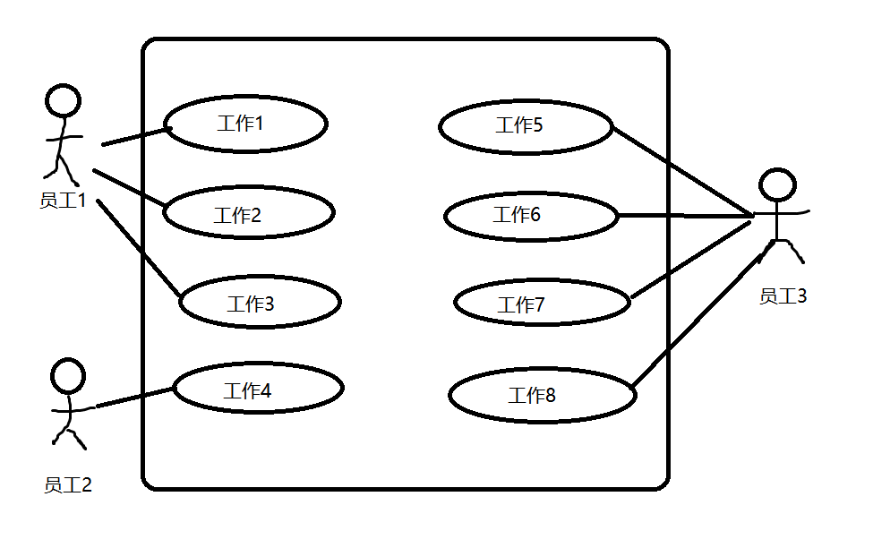

**概念解释** (5 * 6 = 30)
1. stakeholder
2. scope
3. duration
4. quality
5. resource loading

**简答题** (2 * 15 = 30)
1. Narrate the flow of project cost management
2. Narrate the basic response strategies for positive and negative risk

**分析题**

1. 画WBS(10)
2. 列出三种可能的风险(5)

**计算题1**
| 工作     | duration(days) | predecessors     |
| :----:    |    :----:   |          :----: |
| A   | 2       | start  |
| B   | 4        | A,E      |
| C   | 6        | A      |
| D   | 3        | B,C      |
| E   | 7        | start      |
| F   | 2        | E      |
| end   | -        | D,F      |
1. 画网络图(5)
2. 算关键路径(2)
3. duration of c 改为10之后, 关键路径是多少(2)

**计算题2**
EVM的全部计算(16)
