## 第一章 概述

### 1、什么是项目

**项目**：为创造一个特定的产品、服务或成果采取的临时性努力。项目在达到目标或项目终止时结束。项目可以是大的或小的，可以需要很短或很长的时间来完成。**(要记)**

**项目属性(要记)**

- 有特定目的
- 临时的
- 不断细化而逐步开展
- 通常需要不同领域的资源
- 有一个主要客户或发起人(project sponsor)
- 不确定性

**项目经理**与项目发起人、项目团队以及其他参与项目的人员一起工作，以实现项目目标。**(要记)**

项目经理干的事: (1) plan work and work planner (2) 作出决策 (3) 协调干系人之间的要求， 保证满意度（4）控制产品质量（5）监控产品开发过程（6）负责所有项目集成管理中提到的内容（7）对团队负责，平衡各方需求，解决各方冲突（8）向客户作出承诺 **(要记)**

项目经理所需技能：**(要记)**

- 项目管理知识体系
- 应用领域的知识、标准、规范
- 项目环境知识
- 普通管理知识和技能
- 软技能或人际关系能力

**三项约束(要记)**

- **范围**：每一部分有哪些工作？产品什么样？....
- **时间**：完成要多久？怎么安排？如何跟踪进程？...
- **成本**：花费如何？预算多少？如何跟踪控制成本？

### 2、什么是项目管理

**项目管理**：将知识、技能、工具和技术应用到项目活动中，以满足项目要求。可以协调整个项目过程，在达到范围、时间、成本的同时兼顾质量和客户满意度。**(要记)**

**干系人**：参与或受项目活动影响的人。

**PM知识领域**：项目经理必需具备的一些重要知识和能力。10大知识领域(P7)

**项目成功**：有很多标准，如：

- 达到范围、时间、成本目标
- 使客户/发起人满意
- 达到了主要目标

### 3、项目群和项目组合管理

**项目群(Program)**：以协调的方式管理的一组相关项目，可以获得单独管理所不能获得的利益和控制。

**项目组合管理(project portfolio management)**：组织将项目和项目群作为投资组合进行分组和管理。

项目管理关注战术(Tactical)目标，项目组合管理关注战略(Strategic)目标

**项目组合种类**

- 冒险类：业务转变
- 成长类：带来收益
- 核心类：保证业务正常运营，使必须要完成的

### 4、项目管理专业(要记)

**PMBOK**：项目管理知识体系

**PMI(PM institute)**：项目管理协会

PIM提供**项目管理师(PMP)**认证

## 第二章 项目管理和IT背景

### 1、项目管理的系统观点

项目经理要有**系统性思维**：在组织的背景中执行项目的观点。

**系统方法**：采用整体和分析的方法解决复杂问题。包括系统哲学、系统分析、系统管理。

**系统哲学**：系统思考事物的思维模式

**系统分析**：解决问题的方法

**系统管理**：处理业务、技术和组织问题

**系统管理三球模型**

业务、组织、技术

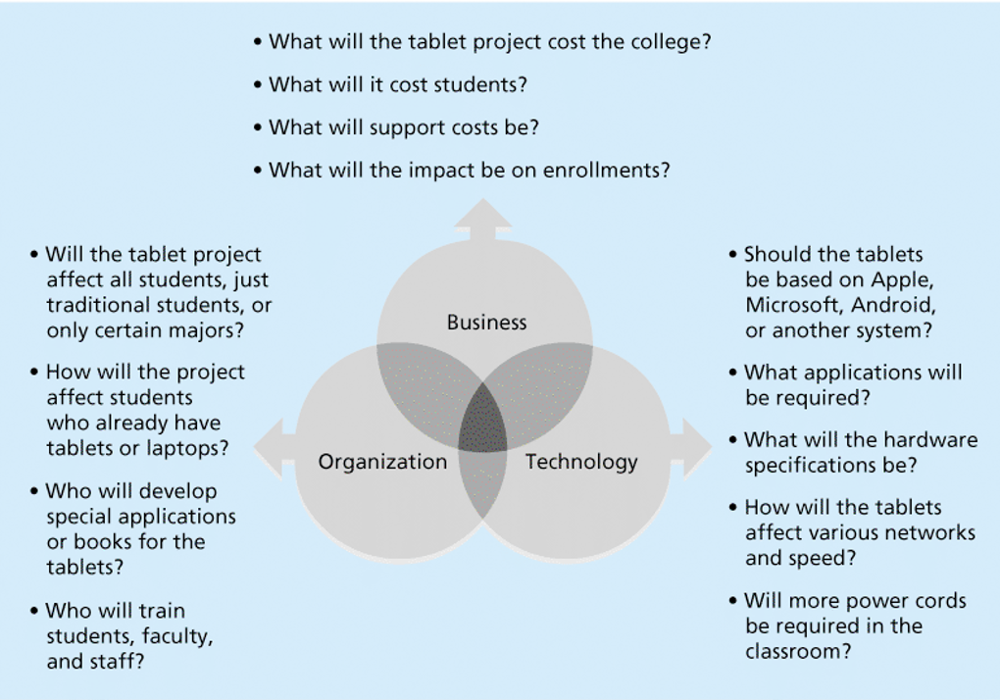

### 2、了解组织

**组织的四个框架(要记)**

- **结构框架**：组织如何构建。通常用组织图说明，关注不同团队的角色和责任。
- **人力资源框架**：在组织需要和人力资源间进行协调
- **政治框架**：不同人和利益集团组成。冲突和权益是关键问题。
- **符号框架**：事件相关的符号和意义。包括文化、语言、传统、形象。如如何着装，工作时间，开会形式等。

**组织结构(要记)**

- **职能型**：职能经理向CEO报告，员工有专业技能
- **项目型：**项目经理向CEO报告，员工有多种技能
- **矩阵型**：二者的中间形式。个人要向职能经理和项目经理报告。矩阵越强，项目经理权威越高。

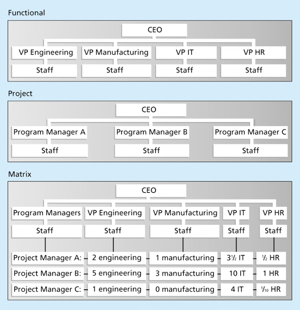

**组织文化**

一系列能刻画组织职能的设想、价值和行为。包括但不限于：

- 成员认同度
- 团队专注度
- 单元集成度：鼓励与其他单元或部门合作的程度
- 抗风险能力
- 奖励标准
- 抗冲突能力：员工把意见和批评放到台面的程度
- 开放系统聚集度：对外部环境改变的检测和响应程度。越强越好

**高层承诺(Top Management Commitment)**非常重要，能给项目经理提供帮助直到、资源、帮助协调其他部门等。

### 3、项目阶段和项目生命周期

**项目生命周期**：一系列项目阶段的集合

**可交付成果(deliverable)**：一个产品或服务

早期阶段：资源需求通常是最低的，不确定性(风险)最高，项目涉众有最大的机会影响项目。

中期：完成项目的确定性提高了，需要更多的资源。

最后阶段：确保项目要求得到满足，发起人批准项目完成。

传统基本阶段：概念-开发-实施-收尾**(要记)**

开发一种产品往往包含许多项目

**系统开发生命周期(SDLC)**：描述开发和维护信息系统所涉及的各个阶段的框架。如瀑布模型、螺旋模型。这两个都是**可预测生命周期**的模式。还有**自适应软件开发(ASD)**，在生命周期早期，需求不能被清晰描述，更加自由。如敏捷开发。**(要记)**

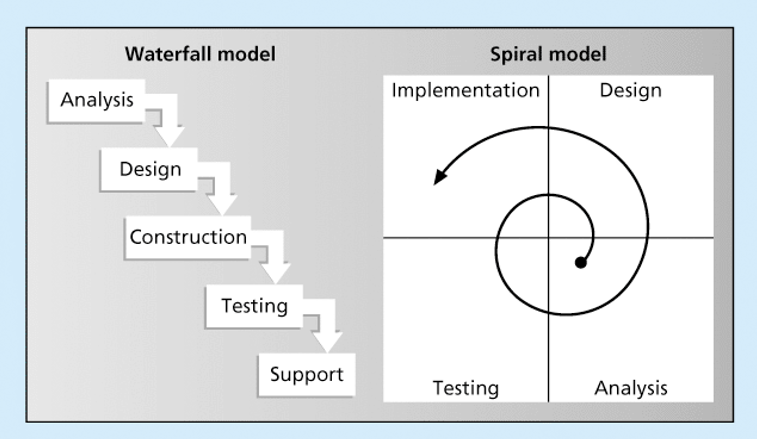

### 4、影响ITPM的最新趋势

- 全球化
- 外包(outsourcing)：低成本、保持竞争力
- 虚拟团队(和线上办公差不多)。优点：在家即可，无需额外场地；成员在全球各地可以不停工作；没有固定的上下班时间。缺点：不适应的话可能会被孤立；沟通可能会出问题；减少了信息传递能力；增加了所需技术依赖性。
- 敏捷项目管理。有名的有**Scrum模型**。敏捷教练(ScrumMaster)将使团队专注于目标**(要记)**

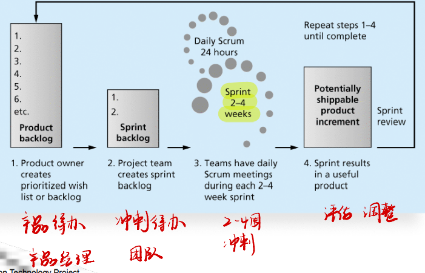

Scrum有三个主要参与者：产品负责人、敏捷教练、Scrum团队或开发团队

## 第三章 项目管理过程组：案例研究

### 1、项目管理过程组

**过程**：针对特定结果的一系列行动。(和项目生命周期有什么区别？)

**项目管理过程组**包括：**(要记)**

- 启动过程(在项目每个阶段都会发生)
- 计划过程(耗时第二)
- 执行过程(最需要时间)
- 监控过程
- 收尾过程

### 2、将过程组映射到知识领域

(见课本P63) **(要记，看着记)**

### 3、案例研究1

**项目预启动**：确定范围，时间、成本限制；识别发起人；选择项目经理；为项目开发一个业务案例；与项目经理讨论项目管理过程和预期结果；决定是否要划分为子项目。

**项目启动**：其知识域、过程、输出如下。(也可见书P69)

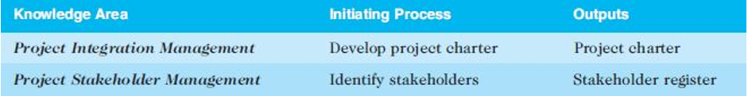

干系人登记表(Stackholder register)如下：(课本P69)。同时可以制定干系人管理策略。

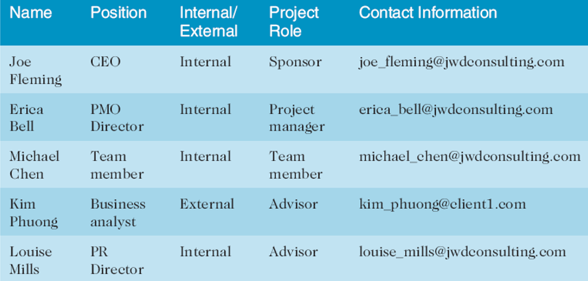

还可以召开项目启动会议(Kick-off Meeting) 

**项目计划**：属于计划过程。重要输出有项目范围说明书、WBS、项目时间表(甘特图)、风险排序清单(部分风险列表)

**项目执行**：属于执行过程。需要最多时间和资源。采取必要的行动完成计划中的活动。里程碑报告挺有用。(P80)

**项目监控**：属于监控过程。包括测量项目目标的进展，监控计划的偏离情况，并采取纠正行动。输出包括性能报告、变更请求和各种计划的更新。

**项目收尾**：属于收尾过程。输出见P85。

### 4、案例研究2

Scrum框架和过程组如下：

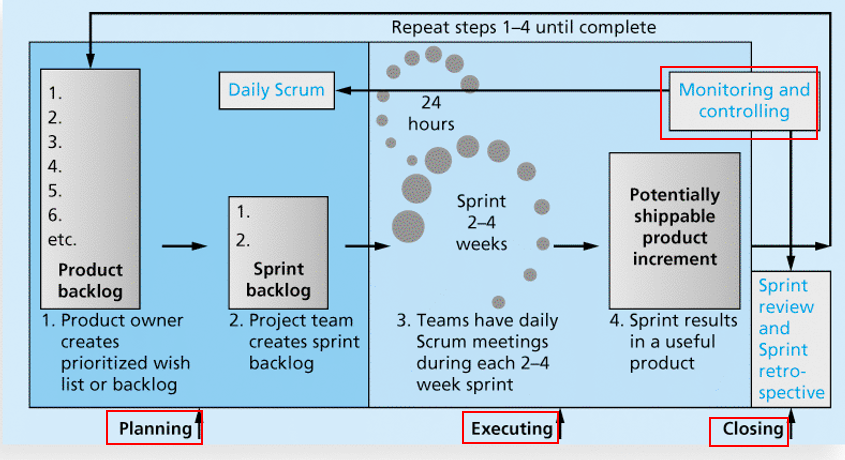

**项目计划**：相同：仍然可以创建范围声明，并可以为整个项目进度使用甘特图;其他计划类似(风险等)。不同：在产品和sprint backlog中确定工作描述，需要估计每个sprint的速度或容量。

**项目执行**：相同：仍然产生产品等。不同：制作多个版本的软件——新软件的用户可能会因为产品的多次迭代而感到困惑；沟通不同，因为项目团队每天都要开会

**项目监控**：相同：仍然检查实际工作和计划工作。不同：使用冲刺板代替跟踪甘特图或其他工具，项目监控可以用燃尽图

**项目收尾**：相同：重点仍然是接受可交付成果和反思。不同：回顾由敏捷教练领导。回顾与经验教训报告类似，但它侧重于更短的时间，如“在上一个sprint中，我们应该继续做什么?”

案例2和1的最大区别是提供多个和一个可用的软件。

## 第四章 项目综合(集成)管理

### 1、什么是项目管理

**项目综合管理(Project Integration Management)**：在项目的整个生命周期中协调所有其他知识领域。包括以下几个过程：

- 和干系人制定项目章程(the project charter)
- 制定项目管理计划
- 指导并管理项目执行
- 监控项目工作
- 综合变更控制
- 项目或阶段收尾

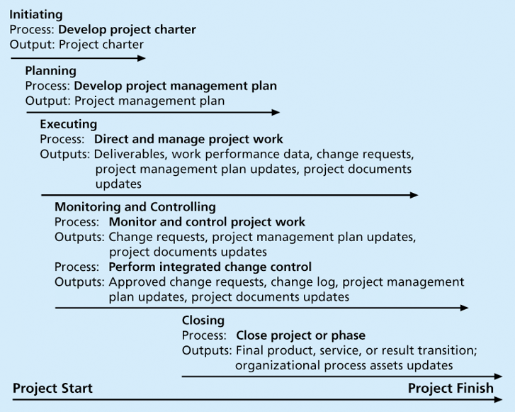

### 2、战略计划与项目选择

**战略计划(Strategic planning)**：分析组织优劣势，研究商业环境中的机会和威胁，确定长期目标，预测未来趋势，预测新产品和服务的需求。

**SWOT分析**：analyzing **S**trengths, **W**eaknesses, **O**pportunities, and **T**hreats。分析优势、劣势、机会和威胁。P103

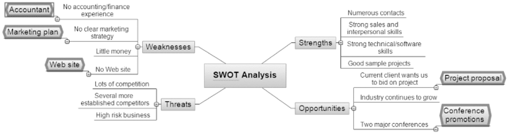

选择IT项目的计划过程：

1. IT战略计划
2. 业务领域分析
3. 项目计划
4. 资源分配

选择项目的方法：

- 关注主要的组织需求：是否满足组织需求、资金、意愿
- 将IT项目分类
- 使用财务分析，如净现值分析(Net present value, NPV)、投资回报率(Return on investment, ROI)、回收分析(Payback analysis)等
- 使用加权评分模型
- 实施平衡记分卡

**净现值(Net present value, NPV)(要记)**

计算预期货币收益或损失的方法，应当考虑NPV为正的项目，越大越好。

计算过程：

1. 确定预期成本和收益
2. 确定折现率(discount rate)：将现金流折现的比例
3. 套下图公式

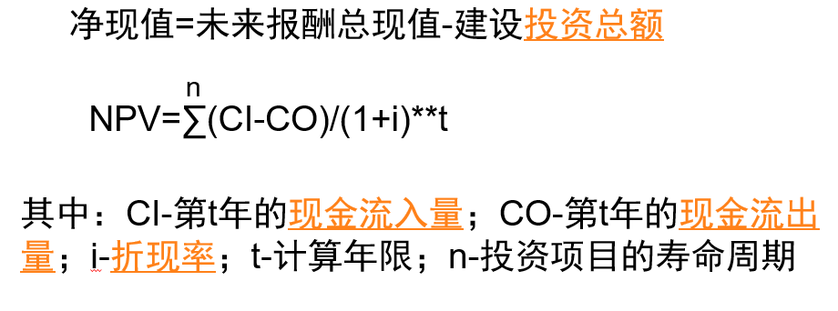

其中，$1/(1+i)^t$为第$t$年的折现因子

**投资回报率(要记)**

$ROI=(折现收益总额-折现成本总额)/折现成本总额$，越大越好。

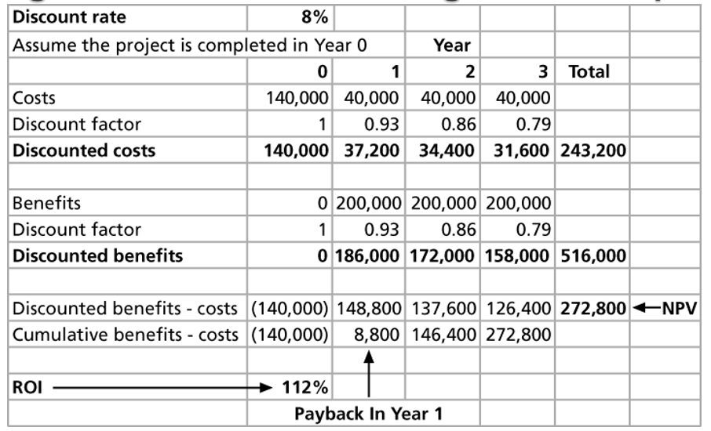

**投资回收期分析**

看累计折现成本和累计折现收益曲线的交点

**加权评分模型**

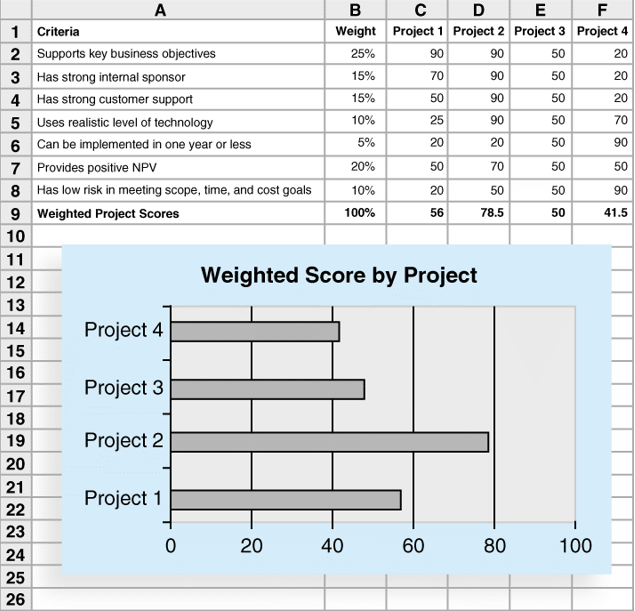

**项目章程**：正式承认项目存在并为项目目标和管理提供指导的文件。

### 3、创建项目管理计划

**项目管理计划**：协调所有项目计划、指导项目执行和控制的文件。包括项目简介、项目如何组织、采用的管理和技术、进度安排和预算等。

### 4、执行综合变更控制

**综合变更控制**涉及在项目生命周期中识别、评估、管理变更。

**三个主要目标：**

- 影响产生变更的因素，以确保变更是有益的
- 确定一个变更发生过
- 及时管理真正的变更

**变更请求书**意义：变更请求书包括了变更⽬标和范围等， 是项⽬综合变更的基础，是变更请求管理的书⾯化体现，有助于对于变更管理规范化， 对变更进⾏有效的控制，便于达到所需求的⽬标。

建立**更好的变更请求管理过程**方法： 设立变更请求书；成⽴变更控制委员会（CCB）；制定合理的变更流程，确定实施计划及开始实施⽇程、 部署变更请求管理系统、不断强化变更管理流程；运用有效的配置管理，以便有效的记录、管理和追踪变更。**(要记)**

## 第五章 项目范围管理

### 1、什么是项目范围管理

**项目范围管理(Project Scope Management)**：对项目中包含或不包含什么的界定和控制的过程。有以下6个过程：

1. 制定范围管理计划
2. 收集需求
3. 定义范围
4. 创建WBS
5. 验证范围
6. 控制范围

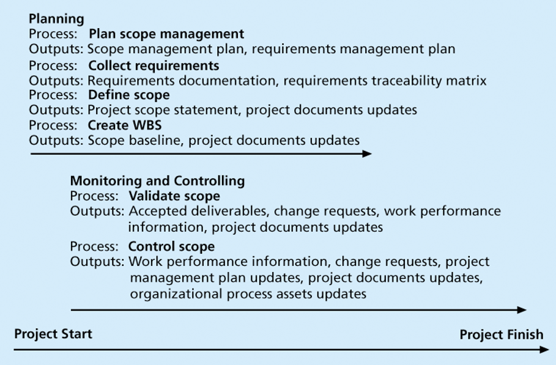

### 2、范围管理计划

内容包括：

- 如何准备详细的范围说明书
- 如何创建WBS
- 如何维护和批准WBS
- 如何验收可交付成果
- 如何控制项目范围变更的请求

### 3、收集需求

方法：

- 访谈
- 研讨会
- 问卷调查
- 观察法
- 原型法
- **基准测试(bench marking)**：通过与组内外的其他产品进行比较，来获得产品特征的需求

跟踪需求可以用**需求跟踪矩阵(Requirements Traceability Matrix, RTM)**

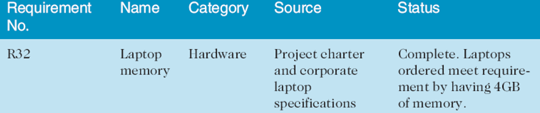

### 4、定义范围

可以依靠项目章程

### 5、创建工作分解结构(WBS)(要记)

WBS层级从1开始！！！

WBS可以按产品组织：(P142)

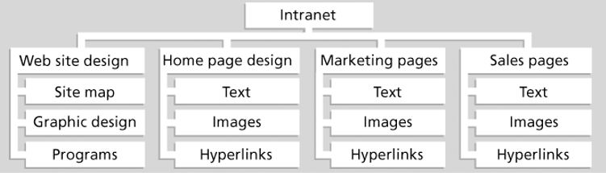

也可以按阶段组织：

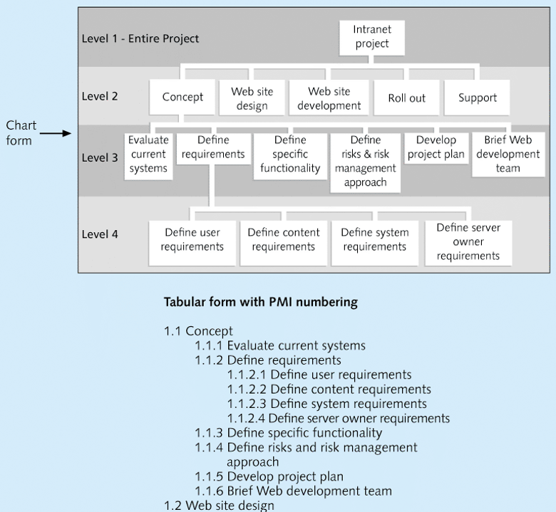

**工作包(work package)**：WBS最底层的一项任务

WBS可以结合甘特图

制定WBS的方法：

- 使用指南
- 类比法：借鉴别的项目的WBS
- 自上而下：分解
- 自下而上：归并
- 思维导图

**WBS字典**：描述WBS的每项条目

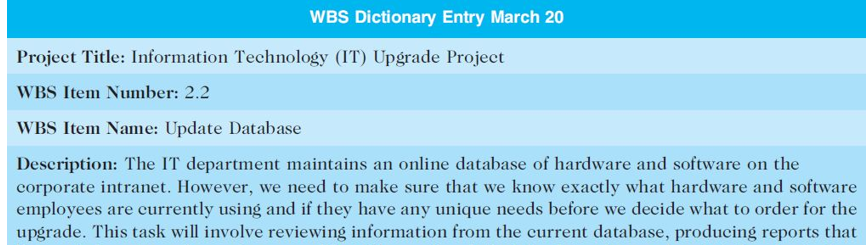

### 6、确认范围

略

### 7、控制范围

目标

- 影响那些导致范围变更的因素
- 确保变更是按照综合变更控制中开发的过程来处理的
- 当变更出现的时候对其进⾏管理

最佳实践

- 范围要符合实际 
- 使⽤户参与项⽬范围管理 
- 如果可能，使⽤现有的硬件和软件 
- 遵守良好的项⽬管理过程

## 第六章 项目时间管理

### 1、什么是~

有7个主要过程：

1. 计划进度管理**schedule management**：制定进度管理计划
2. 定义活动
3. 排序活动
4. 估算活动资源
5. 估算活动工期
6. 制定进度计划
7. 控制进度

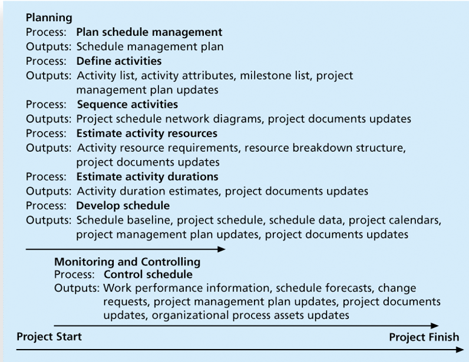

### 2、计划进度管理

略

### 3、定义活动

活动清单和活动属性应当与WBS和WBS字典一致。活动清单有活动名称、标识或编号

**里程碑**：没有工期的重大事件。完成一个里程碑需要一些活动和大量工作。

### 4、排序活动(要记)

**依赖类型**

- 强制依赖(mandatory dependencies)：硬逻辑
- 自由依赖(discretionary 依赖)：软逻辑
- 外部依赖(external)：项目和非项目活动之间的关系

**网络图Network Diagrams**

AOA(activity-on-arrow)：有向边表示活动和工期，节点表示活动开始或结束。又称ADM。如下图

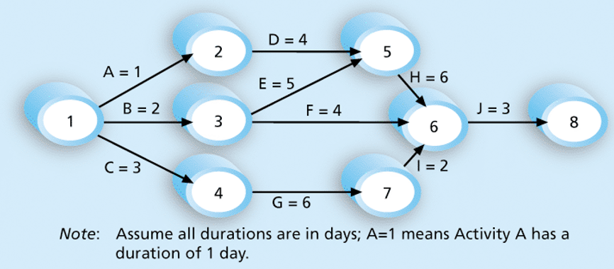

前导图法(Precedence Diagramming Method, PDM)：方框表示活动，有向边表示依赖关系。如下

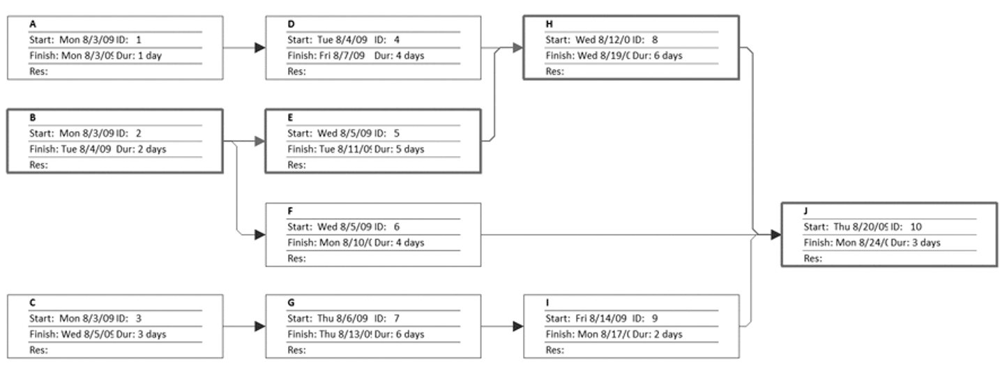

**活动(任务)的四种依赖**

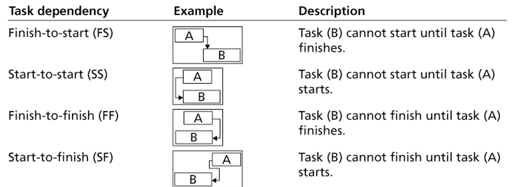

### 5、估算活动资源

进行成本、人力资源、都同管理、风险、采购等估算

### 6、估算活动工期(duration)(要记)

可以使用三点估算：乐观、最可能、悲观的估算。可以结合PERT分析

### 7、制定进度

可用工具和技术：甘特图、关键路径分析、关键链调度、PERT分析

**甘特图图例(要记)**

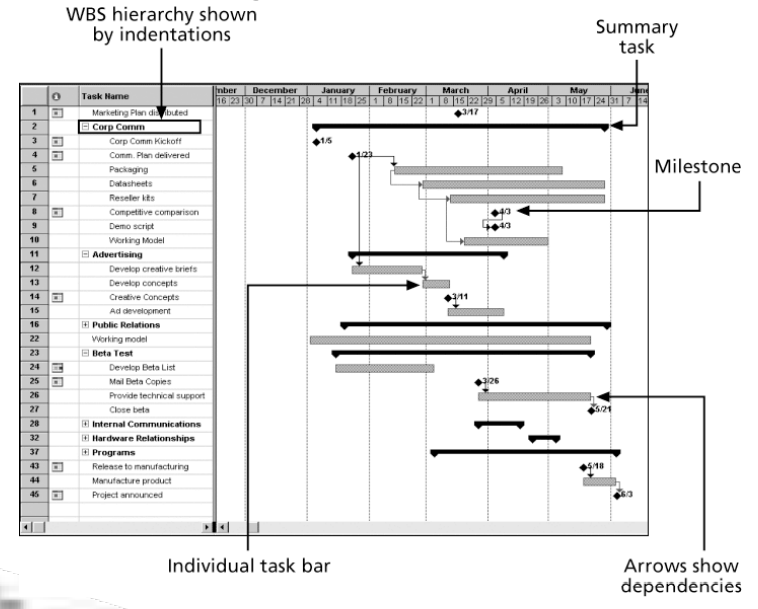

甘特图上可以加里程碑。定义里程碑可以用**SMART**准则：

◦**S**pecific明确的

◦**M**easurable可度量的

◦**A**ssignable可分配的

◦**R**ealistic现实的

◦**T**ime-framed有时间限制的

**关键路径法(CPM)**：找最长的路径，即项目能够完成的最短时间。一个项目可以有多个关键路径**(要记)**

**时差(slack)**或**浮动时间(float)**：在不延迟后续活动或项目完成日期的情况下，可以延迟一项活动的时间

**自由时差**：不延误**后续项目最早开始时间**的情况下，该活动可以被延误的时间。$min\{后续的的ES-这一个的EF\}$

**总时差**：从活动**最早开始时间起**，在**没有拖延计划项目完成日期**的情况下被耽搁的时间。$LS-ES$

正推法：确定最早开始和最早完成(上面两个)

逆推法：确定最晚开始和最晚完成(下面两个)。“最晚”要保证不延迟项目完成时间。

关键路径上，最早开始=最晚开始，最早完成=最晚完成，无自由时差和总时差

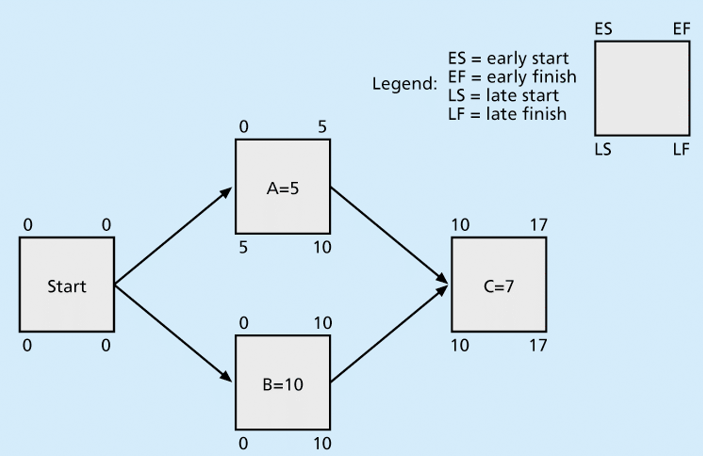

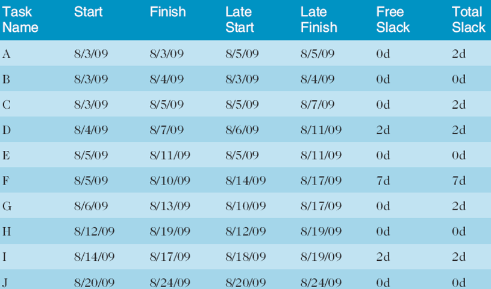

使用关键路径缩短项目进度的方法：

- 增加资源，减少范围
- 赶工
- 快速跟进(fast tracking)：并行

**计划评审技术(PERT)**

一种工期估算方式，公式：

$PERT加权平均=(乐观时间+4\times最可能时间+悲观时间)/6$

### 8、进度控制

属于综合变更控制的一部分

## 第七章 项目成本管理

### 1、什么是~

~是确保在批准的预算内完成项目的必要过程。包括4个过程：**(要记)**

1. 计划成本管理
2. 成本估算
3. 确定预算
4. 成本控制

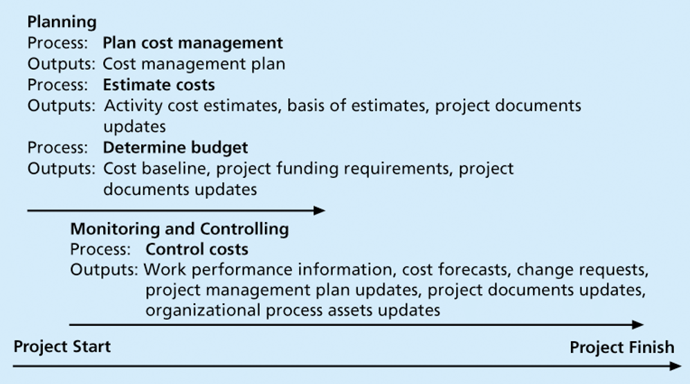

### 2、成本管理的基本原理

$利润=收入-支出$      $利润率=利润/收入$

**有形成本或收益(Tangible costs or benefits)**：容易用货币衡量的成本或收益。对应有无形。

直接成本：与项目和服务生产直接相关的成本。如工资、软硬件成本。可控

间接~：不直接相关。如水电、纸巾等。 难以控制

### 3、计划成本管理

略

### 4、成本估算

3种成本估算类型：

1. 粗粒度估算(rough order of magnitude, ROM)
2. 预算估算(budgetary estimate)
3. 确定性估算(definitive estimate)

从上到下，开始时间越来越晚，精确度越来越高

**成本估算的工具和技术**

- 类比估算(自上而下估算)：借鉴类似项目的实际成本作为估算依据
- 自下而上：估计单个工作项或活动，并将它们相加以得到项目成本总数
- 三点估算：估算最有可能、乐观、悲观，可结合PERT
- 参数估算**Parametric modeling**：在数学模型中应用项目特征(参数)

例子：

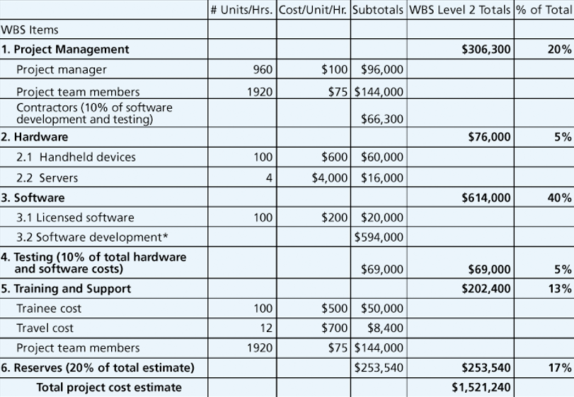

单位时间件数(第2列)是指整个项目完成需要的

### 5、成本预算

略

### 6、成本控制(要记)

**挣值管理(earned value management, EVM)**

- 计划值(**planned value, PV** )：预算。
- 实际成本**(actual cost, AC)**：在**给定时间内**的成本
- 挣值(**earned value, EV** )：**实际**完成工作的成本估算值。$EV=PV\times RP$
- 完成百分比**(Rate of performance, RP)**：第一周本来要干100，实际干了50，则RP=50%
- 成本偏差(**cost variance, CV**)：$EV-AC$。>0 则表示实际低于预算
- 进度偏差(**schedule variance, SV**)：$EV-PV$。 >0则表示实际用时比计划用时短
- 成本绩效指数(**cost performance index, CPI**)：$EV/AC$。>1则表示在预算范围内
- 进度绩效指数(**schedule performance index, SPI**)：$EV/PV$。>1表示项目超前计划

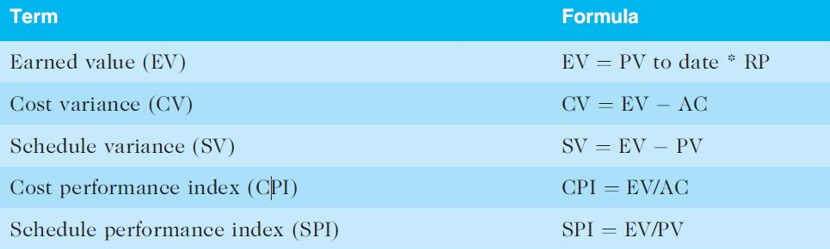

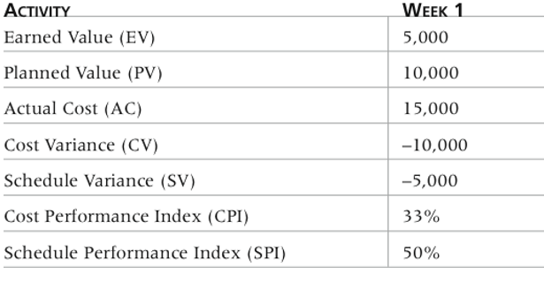

## 第八章 项目质量管理

### 1、质量管理的重要性

略

### 2、什么是~

项目质量管理：确保项目满足它所应满足的需求。包括三个主要过程：**(要记)**

1. 计划质量管理
2. 实施质量保证
3. 控制质量

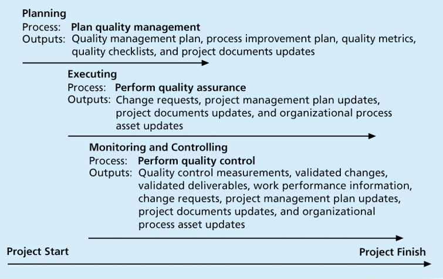

### 3、计划质量管理

影响质量的重要范围部分包括：

- 功能性&特色
- 系统输出：系统产生的界面和报告
- 性能
- 可靠性
- 可维护性

### 4、实施质量保证

略

### 5、质量控制

该过程的主要输出：

- 验收决策：产品是否通过验收的决策
- 返工
- 过程调整

### 6、工具和技术

**因**果图(鱼骨图)**

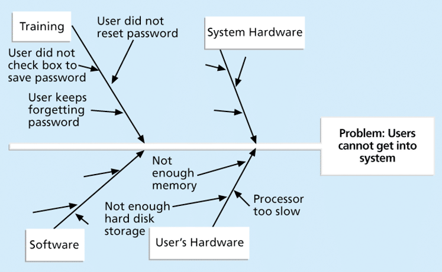

**控制图**

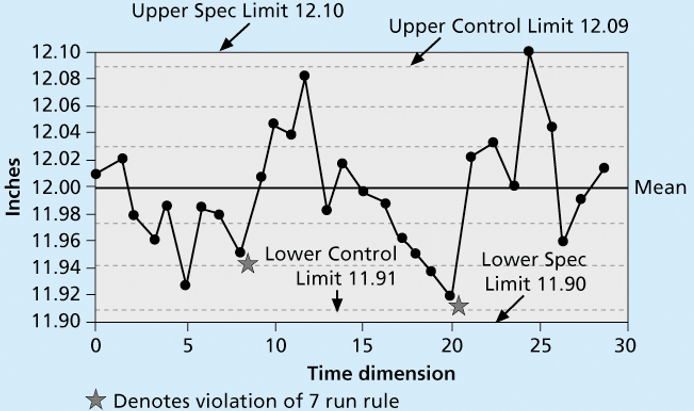

结合七点运行法则：看连续7个点是否都在平均值一侧。出现的话可能有问题

**检查表、散点图、直方图**

**帕累托(Pareto)图**。帕累托分析：80%的问题经常是由20%的原因引起的。**(要记)**

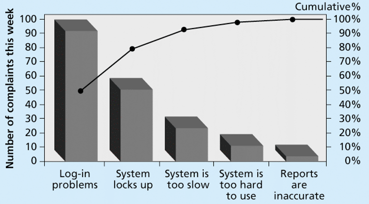

**流程图**

**统计抽样**

**Six Sigma**：100万个机会中有3.4个缺陷。使用时通常遵循**DMAIC**流程**(要记)**

**定义Define**:定义问题/机会、过程和客户需求
**度量Measure**:定义度量，然后收集、汇编和呈现数据
**分析Analyze**:仔细检查过程细节以发现改进机会
**改进Improve**:为改进问题提出解决方案和想法
**控制Control**:跟踪和验证改进的稳定性和解决方案的可预测性

### 7、现代质量管理

略

### 8、提高IT项目质量

略

## 第九章 项目人力资源管理

### 1、~的重要性

略

### 2、什么是~

**人力资源管理**就是最有效地发挥每个参与项目人员作用地过程。包括以下4个过程：

1. 计划人力资源管理
2. 组建项目团队
3. 建设项目团队
4. 管理项目团队

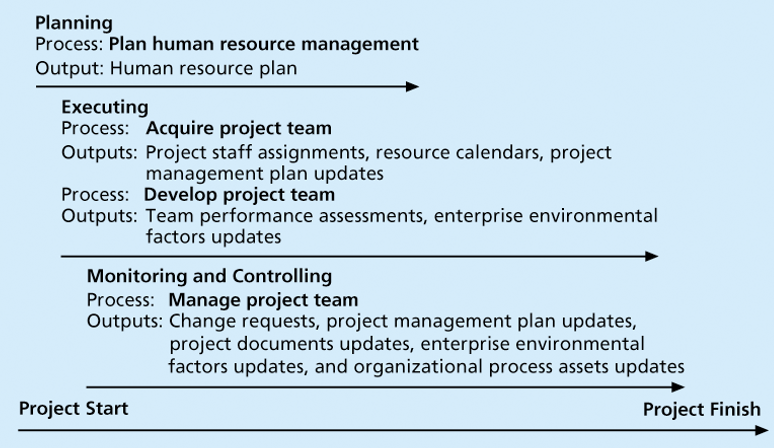

### 3、人员管理关键理论

- **激励理论**。**内在激励(Intrinsic motivation)**：满足个人的兴趣爱好而参加活动；**外在激励(extrinsic motivation)**：为了工资或免受处罚而做事。

  马斯洛需求层次理论。由底层到高层为：生理需求—安全需求—社交需求—尊重需求—自我实现**(要记)**

  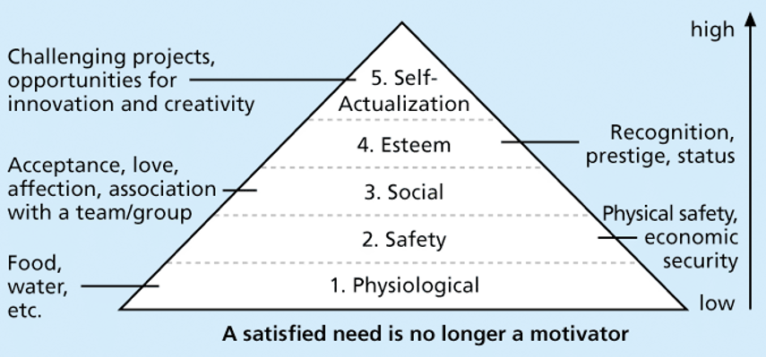

- **影响力和权力理论**

**权力(power)**：影响行为的潜在能力，可以驱使人们做本来不会做的事。主要有5种：强制权力、法定权利、专家权力、奖励权力、感召权力

- **有效性(效率)理论**

项目经理提高工作效率的7种习惯：

- 积极主动
- 开始时就想好如何结束
- 优先事优先做
- 考虑双赢
- 先去理解别人，再寻求别人理解
- 协同
- “磨锯子”，即不断更新自我

### 4、制定人力资源计划(要记)

**组织结构图**

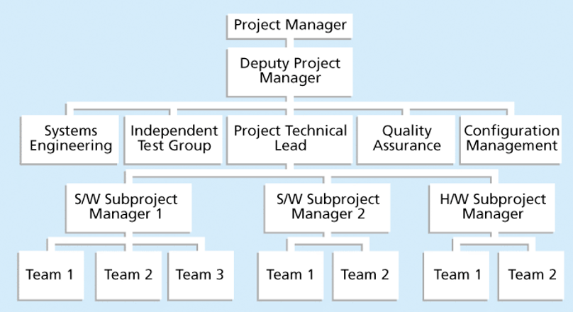

**组织分解结构(OBS)**：一种特殊的组织结构图，显示每个组织单元负责哪些工作。

**责任分配矩阵(responsibility assignment matrix, RAM)**：将WBS条目和OBS相匹配。R：责任组织单元；P：执行单元

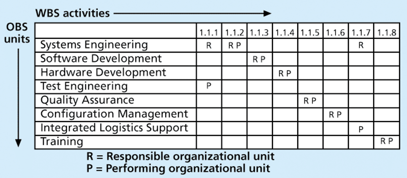

### 5、组建项目团队

**资源负荷(Resource loading)**：现有计划在特定时间段内所需的单个资源的数量

**过度分配**：特定时间内，分配给某项工作的资源超过其可用资源

**资源平衡(Resource leveling)**：通过任务延迟来解决资源冲突的技术**(要记)**

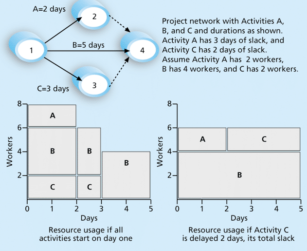

资源平衡好处：

- 资源使用稳定时，需要的管理较少
- 可以使项目经理使用准时制库存策略
- 减少财务部与项目人员方面的一些问题
- 可以提高士气

### 6、建设项目团队

**塔克曼模型(Tuckman model)**描述的团队建设5个阶段：

1. 形成阶段
2. 震荡阶段
3. 规范阶段
4. 执行阶段
5. 终止阶段

团队建设方法：

培训、团建活动、奖励和赏识系统

### 7、管理项目团队

项目经理可以采用的工具和技术有：

- 观察和交谈
- 项目绩效评价
- 人际技能
- 冲突管理

## 第十章 项目沟通管理

### 1、~的重要性

**项目沟通管理**目标：确保项目信息及时适当地生成、收集、发送、存储和部署。有三个主要过程：

1. 计划沟通管理
2. 管理沟通
3. 控制沟通

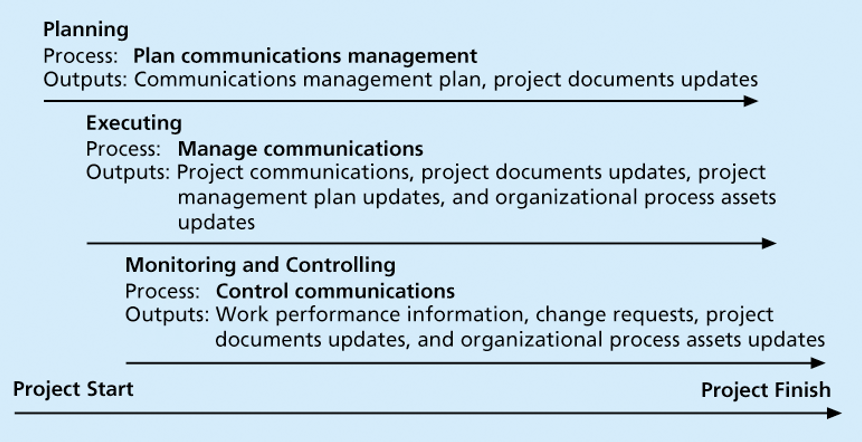

### 2、良好沟通的关键要素

- 理解个人和团体的沟通需求
- 同时使用正式和非正式沟通
- 以有效、适时的方式发布重要信息
- 为坏消息搭建语境
- 确定沟通渠道(**Communications Channels**)的数量：$n(n-1)/2$

### 3、计划沟通管理

沟通管理计划应当包括：

- 干系人沟通需求
- 用于沟通地信息，包括格式、内容和各部分细节
- 谁接收消息，谁产生消息
- 沟通频率
- 增加解决问题地过程
- 用于更新沟通管理计划的修订过程
- 常用术语表

### 4、管理沟通

创建和分发信息应当重要考虑的因素：

- 用技术手段加强信息的创建和分配
- 选择适当的沟通方法和媒介
- 报告绩效**(Reporting Performance)**。绩效报告包括状态报告(描述特定时间点项目所处的位置)、进度报告(描述在一定时间内团队所完成的工作)、预测(基于过去和发展趋势预测项目的进展)。

### 5、控制沟通

略

### 6、改进项目沟通的建议

- 培养良好的沟通技能

- 召开有效的会议

  开会方法：

  - 确定会议是否有必要
  - 明确会议目的和预期结果
  - 确定谁应该参会
  - 开会前向参加者提供议程
  - 事先准备好手稿、工具，提前做好后勤安排
  - 专业地开会
  - 制定会议的基本规则
  - 建立关系(与听众互动)

- 有效使用电子邮件等工具

  如何有效使用这些工具？

  - 选择最适合的媒介
  - 确保信息发送给了正确的⼈
  - 在邮件中使⽤有意义的主题⾏，并尽量将内容限制在⼀个主题下，如果有其他主题，那么就发另外的邮件
  - 确保授权了合适的⼈来分享协作⽂档

- 使用项目沟通模板

## 第十一章 项目风险管理

### 1、~的重要性

**风险效用**：从潜在回报中得到的满意度。有三种类别：风险厌恶型、风险中性型、风险喜好型**(要记)**

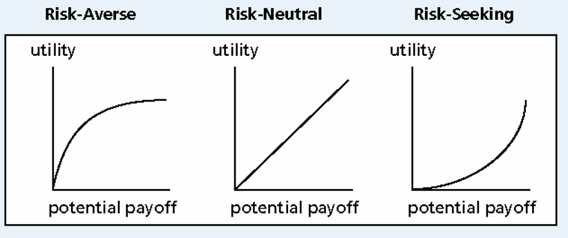

**项目风险管理**目标：使潜在的负面风险最小化且潜在的正面风险(导致好结果的风险，有时也称机会)最大化。包括6个主要过程：

1. 计划风险管理
2. 识别风险
3. 实施定性风险分析
4. 实施定量风险分析
5. 计划风险响应
6. 控制风险

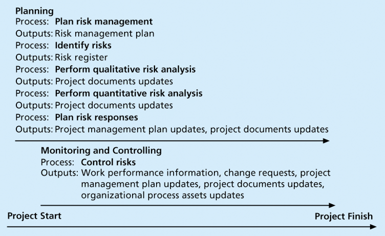

### 2、计划风险管理

**风险管理计划**记录了项目中风险管理的流程。其主要主题为：

- 方法论
- 角色和责任
- 预算和进度
- 风险种类
- 风险概率影响
- 修正干系人承受力：干系人是否可以承受风险的变更？
- 追踪：团队该如何最终风险管理活动？
- 风险文档

### 3、IT项目风险的一般来源

- 市场风险
- 财务风险
- 技术风险
- 人力风险
- 结构/过程风险

**风险分解结构(risk breakdown structure)**可以帮助项目经理考虑各类风险，如下图。

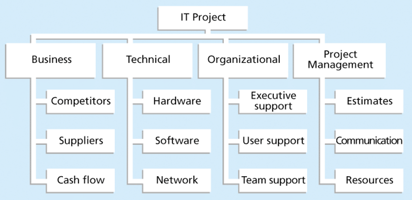

### 4、识别风险

常用工具和技术：

- 头脑风暴
- 德尔菲技术(The Delphi Technique)
- 访谈
- SWOT分析

**风险登记表**记录潜在风险和相关信息的工具。内容包括：

- 风险事件标号
- 风险事件级别：1最高级
- 风险事件名称
- 风险事件描述
- 风险事件分类
- 风险根源
- 触发器(trigger)：实际风险事件的指标或征兆
- 潜在响应
- **风险责任人(risk owner)**
- 发生概率：低中高
- 风险影响：低中高
- 状态

### 5、风险定性分析

方法：

- 使用**概率/影响矩阵(Probability/impact matrixes)**计算风险因子

  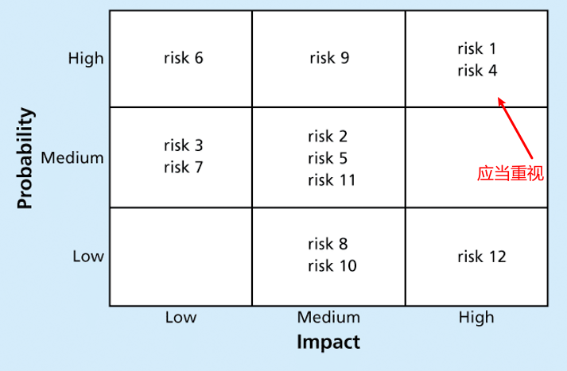

  

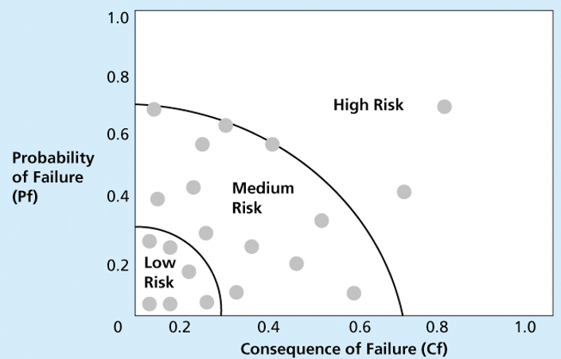

- 十大风险事项跟踪**(Top Ten Risk Item Tracking)** 

  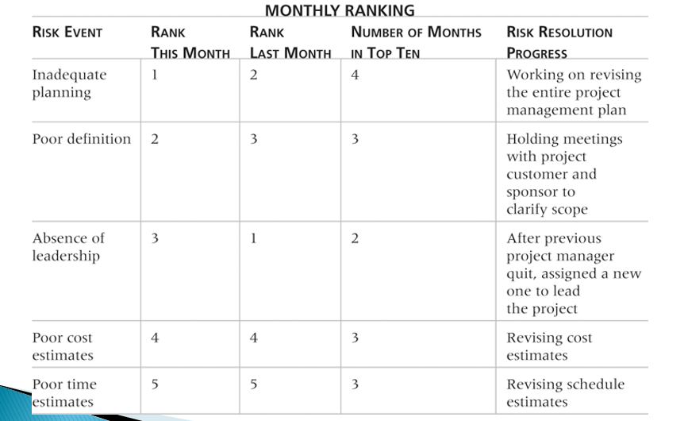

### 6、风险定量分析

方法：

- 决策树。**预期货币值(Estimated monetary value，EMA)**：$风险概率\times风险事件货币值$ **(要记)**

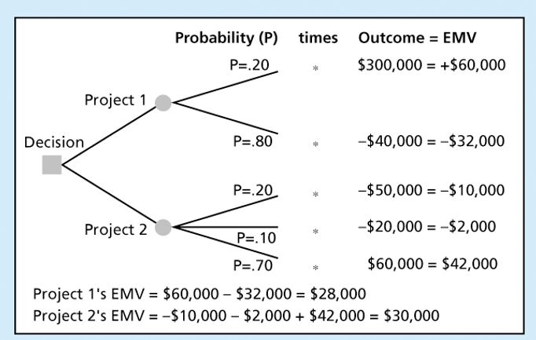

- 模拟：如蒙特卡洛法
- 灵敏度分析(Sensitivity analysis)：通过改变一个或多个变量来观察对结果的影响。(感觉就是调参......)

### 7、风险响应计划

减少负风险、增加正风险的因素和策略。

**应对负风险**的4个基本措施：

- 风险规避
- 风险承担
- 风险转移
- 风险缓解

一些风险缓解策略如下(P336)：

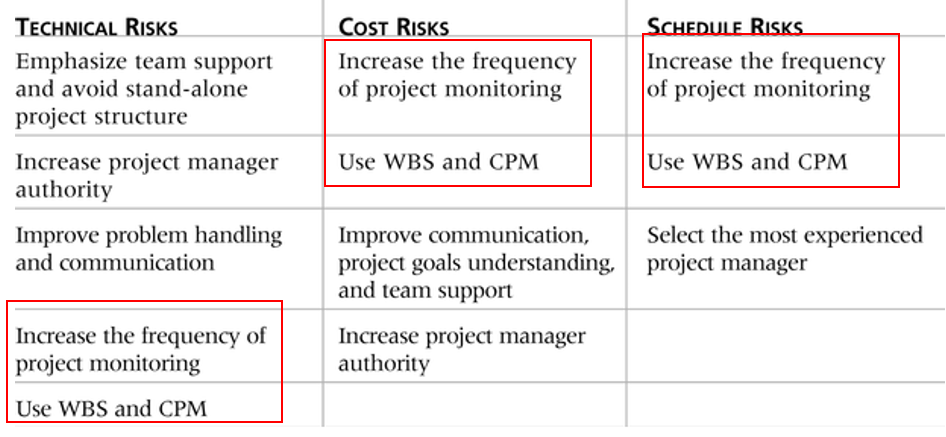

**应对正面风险**的策略：

- 风险开发(Risk exploitation)
- 风险共享
- 风险增强
- 风险承担(Risk acceptance)：啥事不干

### 8、控制风险

略

## 第十二章 采购管理

### 1、~重要性

采购(Procurement)：从外部资源获得商品和服务

**项目采购管理**：为一个项目从外部组织获得商品和服务的过程。有4个主要过程：

1. 计划采购管理：决定采购什么、何时采购、如何采购
2. 实施采购(Conducting procurements)
3. 控制采购
4. 采购收尾(Closing procurements)

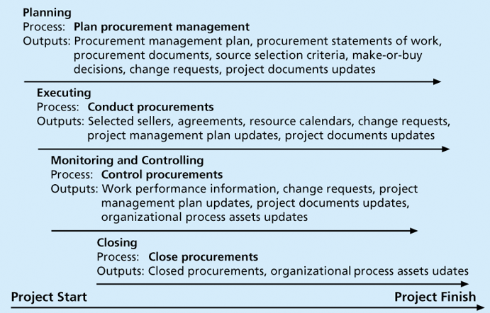

### 2、计划采购管理

组织需要做出**自制/外购决策(make-or-buy decision)**

**固定价格合同(fixed-price contract)**：明确规定产品价格的合同。

**总假设点(point of assumption, PTA)(要记)**

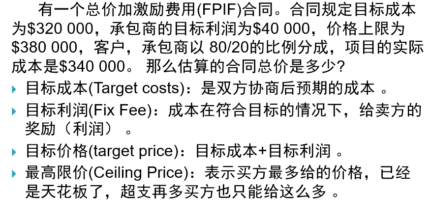

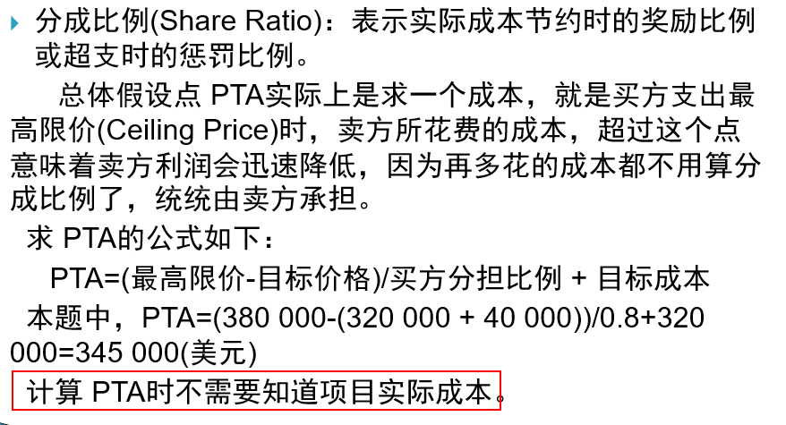

制定采购管理的工具和技术

- 自制/外购分析**(要记P353)**
- 专家评判
- 市场调研

**工作说明书(statement of work, SOW)**：采购所需工作的描述

**采购文档**常见的包括：建议书邀请函(request for proposal, RFP)，卖方准备，可以满足买方需要的不同方案的文档；报价邀请函(request for quote, RFQ)：卖方准备的一个价格文档。

### 3、实施采购

略

### 4、控制采购

略

### 5、采购收尾

略

## 第十三章 干系人管理

### 1、~的重要性

4个过程：

1. 干系人识别
2. 干系人管理计划
3. 参与干系人管理
4. 参与干系人控制

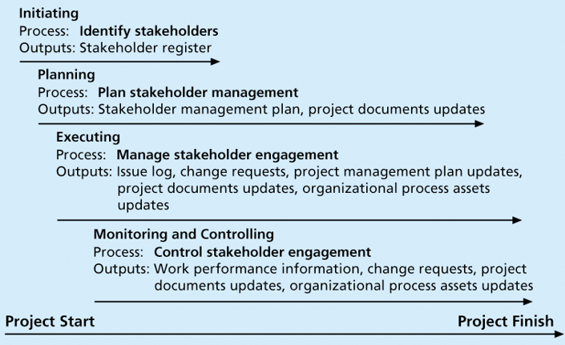

### 2、识别干系人

干系人可以分为内部(internal)和外部(external)。

记录干系人基本信息可以用干系人登记表(stakeholder register)，包括以下的内容：

- 身份信息：名字、职位、联系方式、角色等
- 评估信息：干系人主要的需求和期望
- 干系人分类：内部or外部？支持项目or反对项目？

干系人分析可以使用**权力/兴趣网格(power/interest grid)**

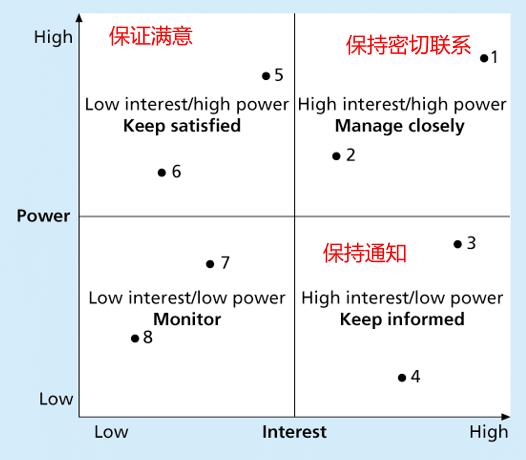

干系人参与等级：

- 无意识
- 抗拒
- 中性
- 支持
- 领导

### 3、干系人管理计划

略

### 4、参与干系人管理

**期望管理矩阵**可以帮助明确期望，从而让干系人满意。

### 5、参与干系人控制

略

## 附录

这里记一下找不到在哪里的一些概念

**基准(baseline)**： 批准的项目管理计划加上核准的变更。

